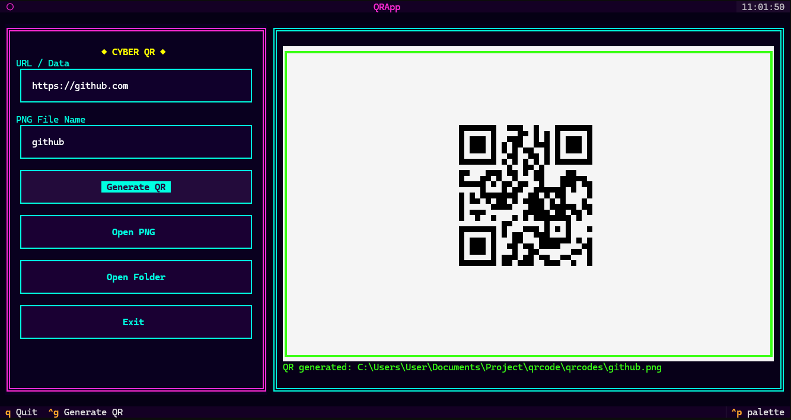

# QR-Code-Generator-Retro

A cyberpunk-themed QR Code Generator built with Python and Textual.



Retro-inspired interface with:

- Neon colors
- Dual-panel layout
- QR preview area
- File path display
- One-click file/folder opening

---

## Features

- Generate QR codes from URLs or text
- Save QR codes as `.png` files
- Real-time QR preview inside the terminal
- Open the generated image directly
- Open the output folder quickly
- Retro CRT / Cyberpunk UI powered by Textual
- Keyboard shortcuts for faster operation

---

## Prerequisites

- Python 3.10 or later

Install the required packages:

```bash
pip install textual qrcode[pil]
```

or

```bash
pip install textual
pip install qrcode[pil]
```

---

## Project Structure

```
qr-generator/
│
├── qr.py
├── qrcodes/
│   ├── example.png
│   └── ...
└── README.md
```

Generated QR codes are automatically saved inside the `qrcodes/` folder.

---

## How It Works

1. Enter a URL or text.
2. Enter a file name (without or with `.png` extension).
3. Click **Generate QR**.
4. The QR code will appear immediately in the preview panel.
5. The QR code is saved as a PNG file inside the `qrcodes` folder.
6. Optionally:

   - Open the generated PNG file.
   - Open the output folder.
   - Exit the application.

---

## Running

Start the application:

```bash
python qr.py
```
or Double click qr.py

---

## Keyboard Shortcuts

| Key | Action |
|------|--------|
| `Ctrl+G` | Generate QR |
| `Q` | Quit |

---

## Example

Input:

```
URL:
https://github.com

Filename:
github.png
```

Output:

```
qrcodes/github.png
```

---

## Dependencies

- [Textual](https://github.com/Textualize/textual) — Terminal UI framework
- [qrcode](https://github.com/lincolnloop/python-qrcode) — QR code generation
- Pillow — Image processing

---

## License

MIT License
